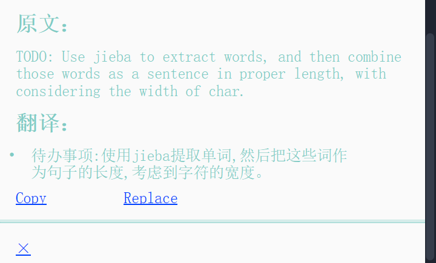
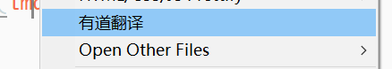
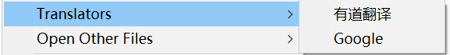
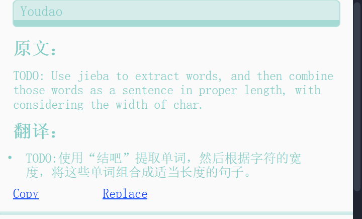

# Translators
A beautiful translation plugin for Sublime Text.



## Installation
Before you install this plugin, you need to install my another plugin [dctxmenu](https://github.com/absop/dctxmenu)(**Dynamic Context Menu**). Because this plugin(**Translators**) uses **dctxmenu** to generate menus dynamically.

### !! Note:
Please make sure that **dtcxmenu** is installed correctly in a subdirectory called **dtcxmenu** in your package directory. If you're using `git clone`, you won't have this problem, but if you're using a browser to download it, you'll need to change the folder name.

The following steps assume that you already have [Package Control](https://packagecontrol.io/) installed.

### Installation Steps
1. Copy the URL of this repository: <https://github.com/absop/Translators>
2. Enter into Sublime Text, press down the shortcut <kbd>Ctrl+Shift+P</kbd> to enter into **Command Palette**
3. Input the command `pcar(Package Control: Add Repository)`
4. Press down the shortcut <kbd>Ctrl+V</kbd>, then <kbd>Enter</kbd>
5. Using **Package Control** to install this package
   1. Press down <kbd>Ctrl+Shift+P</kbd>
   2. Input `pcip(Package Control: Install Package)`
   3. Input `Translators`


## Settings
The default settings are shown below
```json
{
    "separator": "|\\\n\f\t /:,;<>.+=-_~`'\"!@#$%^&*({[（《：；·，。—￥？！……‘’“”、》）]})",

    "auto_select": true,

    // options: "phantom", "popup" and "view"
    "style": "popup",

    // path to css file for mdpopups
    "mdpopups.css": "Packages/Translators/mdpopups.css",

    "caption": "Translators",

    "youdao": {
        "enabled": true,
        "caption": "有道翻译",
        "from": "auto",
        "to": "auto",
        "api_url": "http://openapi.youdao.com/api",
        "app_id": "",
        "app_key": "",
    },

    "google": {
        // not implemented!
        "enabled": false,
        "caption": "Google",
        "api_url": "",
        "app_id": "",
        "app_key": "",
    }
}
```
Among them:
- `separator` is used to extract words.
- `auto_select` is used to control whether to display the translation menu when you don't select any words but click the right mouse button.
- `style` is used to control how to display translation results, as the comment area shows, there are 3 display styles.
- `caption` is the caption of folded menu items (when there are multiple usable translators, menu items will be folded to be one top menu, contains several subitems, as shown in the screenshot below).

### One items


### Folded sub menu items



## Key Binding
|              Keys               | Features                                                |
| :-----------------------------: | ------------------------------------------------------- |
| <kbd>ctrl+shift+y, ctrl+t</kbd> | Translate words with `Youdao translator`               |
| <kbd>ctrl+shift+y, ctrl+c</kbd> | Copy translation result                                 |
| <kbd>ctrl+shift+y, ctrl+i</kbd> | Insert the translation result next to the original text |
| <kbd>ctrl+shift+y, ctrl+r</kbd> | Replace the original text with translation result       |


## Advanced Features
To improve translation results of **youdao translator**, you can go [HERE](https://ai.youdao.com/) to register and obtain a app-key for **youdao translator**, then fill them in the Settings file. If you are a new customer of Youdao, they might give you a discount of ￥100.

You can find a lot about this on the Internet.

The following image shows a sample of translation with `app-key`, you can see the difference between the above translation(without 'app-key') and it.



## TODO
- [ ] Add checkbox for every `translation` and `explanation`, select to copy/insert/replace.
- [ ] Improve the showing of results.
- [ ] Consider to cache translation results.
